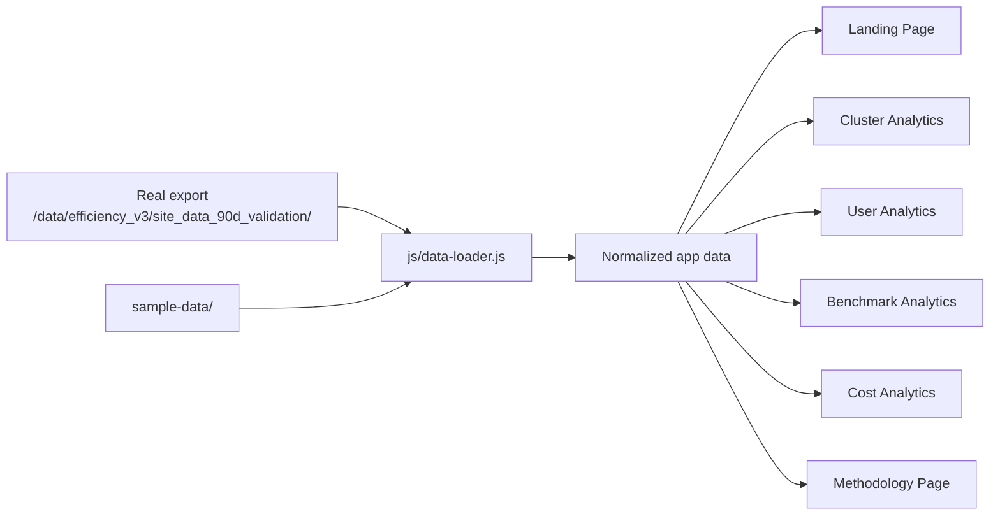

# Data Architecture

The loader always attempts the mirrored real export first. If that path is unavailable or incomplete, it falls back to `sample-data/` so the UI remains functional during development and in offline environments.
